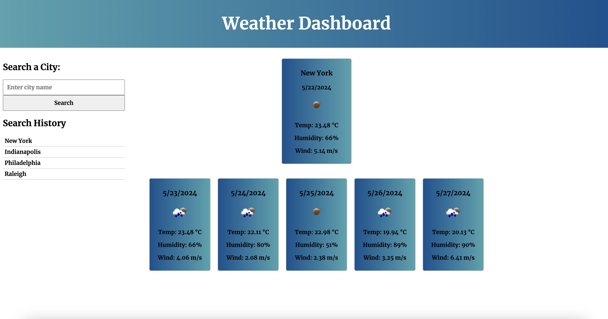

# weather_dashboard

## Description 
This app searches for and displays the current weather and the five day forecast for the entered city.

## Technologies
HTML, CSS, JavaScript, Weather API

## Repository
https://github.com/Jlvstrasse/weather_dashboard

## Usage
Enter a city into the search bar. Click on the search bar or press enter on keyboard. This will trigger the current weather and the forecast to show up. Every search is logged in local storage and appears on the side of the page.

## License
MIT License

## Deployed Application
https://jlvstrasse.github.io/weather_dashboard/